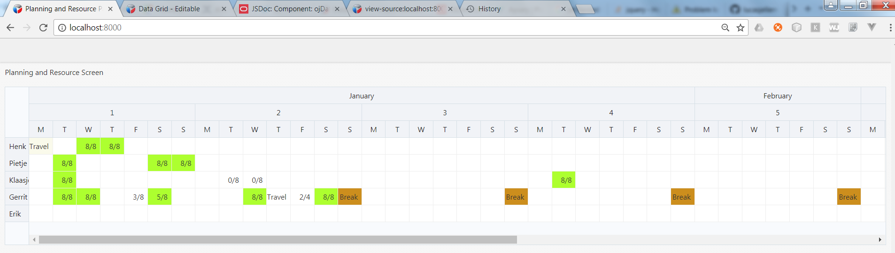
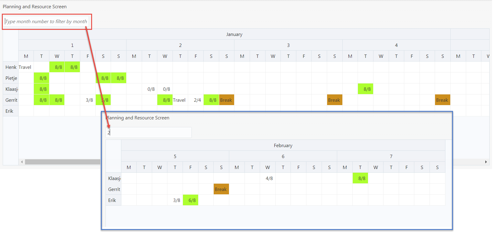
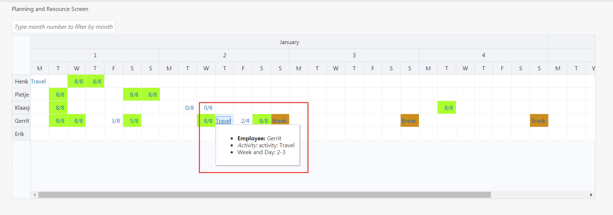
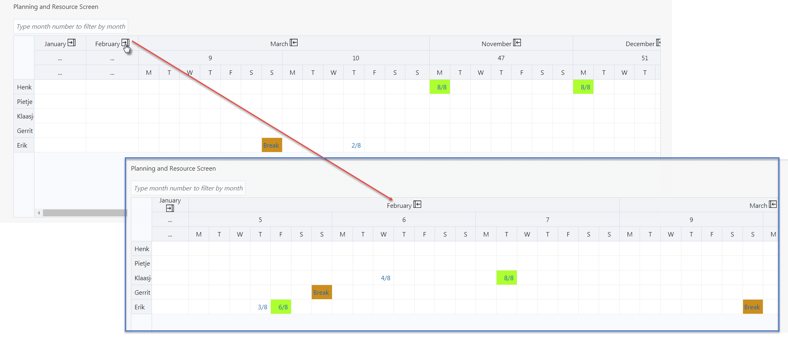
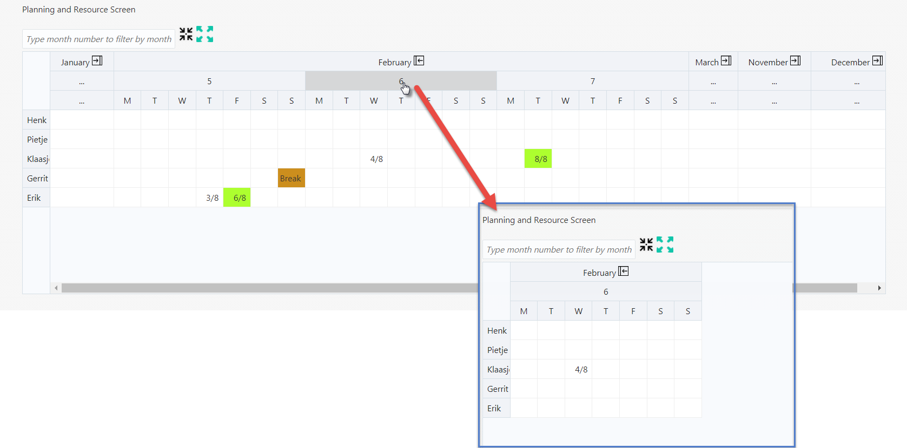

# jet-nestedheader-datagrid-planandresource
Sample Oracle JET application with a datagrid using Nested Headers and Cell styling

This is what the page more or less looks like:

There is now also a filter option. When you type the month number into the search field, the data set underlying the datagrid is filtered and the grid is repainted with the filtered values. Remove the month number to get the original data set back in full.

Also support for a popup per cell. When the mouse hovers over a cell or the cell contents is clicked, the popup opens for that cell (positioned at that cell) with some additional information for the cell. The popup data is written when the click occurs - to placeholders in the popup HTML.

Support for Expand and Collapse at month level. With collapse, all days and weeks are reduced to a single column. With expand, the reverse takes place.

Support for Expand All/Collapse all - to expand or collapse all months and weeks in one step.

Also support for zoom in/drill down: click on a month or week header to bring that month or week exclusive into focus

To install and run:

* clone Git repository
* on the command line in the root directory of the project, execute: npm install
* on the command line in the root directory of the project, execute: grunt build serve
* open your browser at http://localhost:8000

